# Suttton 強化学習

## 章立

1. 序

    **(テーブル形式の解法)**

2. 多腕バンディット問題
3. 有限マルコフ決定過程
4. 動的計画法
5. モンテカルロ法
6. TD学習
7. nステップ・ブーストラップ法
8. テーブル形式手法におけるプランニングと学習

   **(近似による解法)**

9. 近似を用いた方策オン型予測
10. 関数近似を用いた方策オン型制御
11. 近似を用いた方策オフ型手法
12. 適格度トレース
13. 方策勾配法

    **(さらに深く)**

14. 心理学
15. 神経科学
16. 応用と事例紹介
17. 強化学習のこれから

## (テーブル形式の解法)

### 1 序

- 強化学習というアプローチは，相互作用に基づく目標志向型の学習

- 1-1. 強化学習
  - 強化学習では、数値化された報酬信号を最大化するために何をすべきかを学習する
  - 試行錯誤と遅延報酬
  - 教師なし学習とは、報酬を最大化することと、各利他構造を見つけ出すわけではないこと
  - 強化学習にあって他にない困難な課題は、探索と活用のトレードオフ
  - 強化学習で興味深い特徴は、ほかの工学分野理学分野との相互作用

- 1-2. 強化学習の例
  - 意思決定を伴うエージェントとその環境との相互作用、状況が不確かであったとしても、目標を達成しようとする
  
- 1-3.強化学習の構成要素
  - 方策、報酬信号、価値観数、モデル
  - 方策:あるエージェントのふるまいを定義、環境で知覚している状態からとるべき行動
  - 報酬:強化学習の問題において目標を定義
  - 価値関数：長期的に何が良いかをあらわすもの
  - モデル：環境の挙動を模倣する、次状態と報酬の予測
  - モデルベースとモデルフリー
    - モデルベース：モデルとプランニングで強化学習を解く
    - モデルフリー：試行錯誤によって問題を解く
  - 進化計算では
    - 価値関数は評価しない。静的な方策空間を探索する。
    - 方策空間が小さければ問題ない。
    - どの状態をとったか、どの行動をとったかは意識されない
    - 途中の行動は評価されないで、最終結果のみ利用

- 1-4.三目並べ
  - greedyと探索
  - TD学習　$V(S_t)←V(S_t)+α[V(S_{t+1})-V(S_t)]$

- 1-7. 強化学習の成り立ち
  - ２つある
    - 試行錯誤に関する動物の学習心理学
    - 最適制御問題、価値観数、動的計画法を用いた解法
  - その他主な研究
    - 1894 Morgan 動物の行動の本質、学習、試行錯誤。
      - 同じ状況でとられる反応のなかで、他の条件が同じならその状況と反応は結びつきやすい
      - 満足感・不快感の大きさでも、結びつきは大きくなる
    - 1927 Pavlov 強化子最適
    - 1933 Thomas 試行錯誤の学習をした電気機械
    - 1960-70 試行錯誤研究は稀有になった。教師あり学習との混同
    - 学習オートマトン、バンディット問題
    - 1978 Sutton TD学習に基づいた古典的条件付けの心理学モデルを作る
    - 1981 Minsky TD学習と試行錯誤を組み合わせたactor-critic手法を開発
    - 1989 Watkins Q学習

### 2 多腕バンディット問題

- 2-1. k本腕バンディット問題
  - 2つ以上の状態を持たない単純な設定で強化学習の評価的な側面を見る
  - 行動選択は、スロットマシンのレバーを1つ引く。獲得利益を最大化する
  - 行動の価値は、報酬の期待値

- 2-2. 行動価値手法
  - 推定値は、行動が選択された時の平均報酬
  - ε-greedy法：基本即時報酬最大で、小さい確率で全行動からランダム選ぶ
  - 完全greedyでは最適解にたどり着けないことがある。特に価値が
  - 非定常な問題には対処できない
- 2-4. 逐次的実装：逐次価値を更新できるように計算を簡略化
- 2-5. 非定常問題：遠い過去より、新しい報酬に老籾をつける。指数直近性加重平均
- 2-6. 楽観的初期値：極端に報酬をもらえる初期値を設定して探索を促す
- 2-7. 上限信頼区間行動選択：不確実性、分散の程度を表す上界を設定
- 2-8. 勾配バンディットアルゴリズムを設定：ほかの行動との相対的評価のため、ソフトマックス関数を使う
- 2-9. 連想探：次の状況にも影響を与える
- 2-10.まとめ
  - 探索と活用のバランスをとるGittins指数と呼ばれる特殊な行動価値として研究される。ベイズ手法の一例

### 3　有限マルコフ過程

- 3-1. エージェントと環境の境界
  - エージェント：学習者
  - 環境：エージェントと相互作用する外側すべてのもの
  - 状態、行動、報酬
  - 有限MDPでは、状態、行動、報酬はすべて有限個の要素を持つ
  - マルコフ決定過程では、環境のダイナミクスの特徴はすべて確率で決まる
  - マルコフ性...状態と報酬は、直前の状態と行動のみに依存する
  - エージェントと環境の境界は、エージェントが自在に制御できるか
- 3-2~
  - 目標は報酬で定式化
  - エピソードは、期待収益、割引の概念で表される
  - 方策：状態からとりうる行動への選択確率の写像
  - 価値関数：特定の状態にいることがどれほどよいか。期待収益で定式化される
    - 状態価値関数

    - 行動価値関数
    - 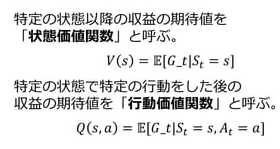
  - ベルマン方程式:行動をとる確率×期待収益
  - 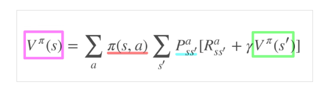
  - 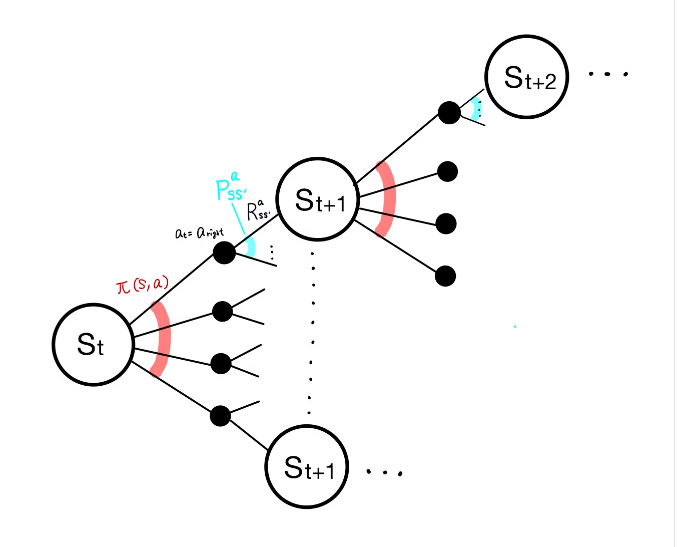
  - 最適行動価値関数
  - 最適方策

### 4 動的計画法

- 動的計画法とは、環境の完璧なモデルがマルコフ決定過程として与えられた場合に、最適方策を計算できるような一群のアルゴリズム
- 方策評価
  - 反復方策評価

- 方策改善
  - より良い方策を見つける。sでaをとり、それ以外は現在の方策で言った場合に改善するか否かを確かめる
  - 以上、方策評価、方策反復を繰り返すことで最適方策を探す手法を方策反復と呼ぶ
  - ただし、反復のたびに方策評価が必要であり、長い反復計算が必要
  - 価値反復：方策評価を1回の掃き出しのみで打ち切る

- 非同期動的計画法
  - 任意の順番で状態を上書き更新する反復手法
- 一般化方策反復
  - 方策評価と方策改善の過程が相互に作用する

- 動的計画法の効率
  - 次元の呪いに注意

### 5 モンテカルロ法

- モンテカルロ法は、サンプル収益の平均化にもとづき強化学習を解く。経験、シミュレーションによる環境との相互作用から得られる状態、行動、報酬のサンプル系列を使う
- 事前知識がなくとも予測可能

- モンテカルロ予測
  - 初回訪問MC法：初回の状態に続く収益の平均値
  - 逐次訪問MC法：状態を訪問した際の収益の平均値として推定
- 行動推定のモンテカルロ推定
- モンテカルロ制御
  - 一般化方策反復をモンテカルロの行動推定に当てはめる
- 開始点探索を使わないモンテカルロ制御
  - 開始点探索の仮定：すべての状態行動対が無限の回数訪問されていることが保証される
  - 方策オン型：意思決定に使っていた方策を評価、改善する
  - 方策オフ型：データを生成するのに使うものとは異なる方策を評価
- 方策オン型：
  - ex, ε-グリーディ方策
- 方策オフ型：
  - 学習されるターゲット方策と、挙動生成に用いる挙動方策を分ける。
  - 重点サンプリング：ターゲット方策と挙動方策の下で発生する相対的な確立により収益を重みづけする
- 逐次的実装：エピソードごとに逐次的な実装が可能
- 割引や意思決定ごとの重みづけも可能

### 6 TD学習

- TD：時間的差分
- モンテカルロ法と動的計画法のアイデアの組み合わせ

- 最も単純なevery visit MC法では，Gtをt期以降の(経験に基づく)リターン，αをステップサイズの定数として，
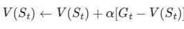
という更新を行う．この方法を(constant) α-MC法と呼ぶ．

- TD(0)法:最もシンプルなTD法。報酬をもとに各タイムステップで計算可能(上記は最終タイムステップまで必要)
- 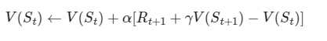
サンプル更新；後続の状態をサンプリングし、その価値と遷移に伴う報酬を用いてバックアップする値を計算する。TD法、モンテカルロ法はこのサンプル更新に該当。

- TD誤差：その時点での推定値の誤差
- 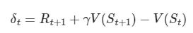

- バッチ学習

- Sarsa法：方策オン型TD制御
- εgreedy法で、方策から得られた行動で価値を更新
- 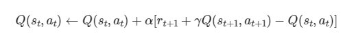
- 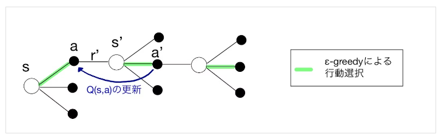

- Q学習：方策オフ型TD制御
- 行動を選ぶための方策とは関係なく、行動価値関数を直接近似
- 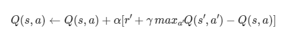
- 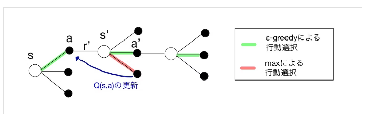

- 期待Sarsa法
  - 最大値をとっている部分を書く行動が起こる確率をもとに期待値を出す
- 最大化バイアス
  - 推定価値の最大値を扱う最大化操作により、大幅な正のバイアスをもたらすこと
- 二重学習
  - サンプルを2つに分割し、それぞれで推定値を出す。一方の推定値を用いてもう一方を最大化する。

### 7 nステップブーストラップ法

- モンテカルロ法、1ステップTD法の間のふるまい
  - モンテカルロ法：エピソード終わりまでの報酬より価値更新
  - 1ステップTD法：次の行動までの報酬より価値更新

- nステップ収益：n個先の行動までを考慮
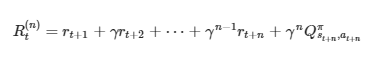
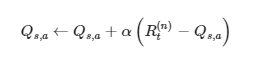

- nステップSarsa
- nステップ方策オフ型学習
  - 重点サンプリング
- ツリーバックアップ法
- nステップQ(σ)法

### 8 テーブル形式手法におけるプランニングと学習

- モデルベース手法：
  - 環境モデルが必要な手法。
  - 動的計画法、ヒューリスティック手法など

- モデルフリー手法：
  - モデルの必要ない手法
  - モンテカルロ法、TD法など

- モデル：エージェントが自身のとる行動に対して環境がどのような応答をするかを予測するために用いることのできるあらゆるもの

- プランニング：モデルを入力とし、モデリングされた環境を相互作用することで方策を生成・向上させる

- Dyna-Q：モデルベース、モデルフリーを両方利用
- 優先掃き出し法
- 遷移軌道サンプリング
- リアルタイム動的計画法
- ヒューリスティック探索
- ロールアウト：現在取りうる行動から開始し、方策に従った場合の収益を平均することで方策の行動価値を推定
- モンテカルロ木探索
  - ベースはロールアウト。選択、拡張、シミュレーション、バックアップのステップより構成される。

## (近似による解法)

### 9 近似を用いた方策オン型予測

- 価値観数をテーブルとして近似せず、重みベクトルで与えられた状態の価値近似で表記
  - 学習による汎化が期待できる一方、扱いが難しくなる

- 価値関数の近似
- 予測の目的関数
  - 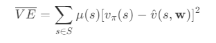
- 確率的勾配法
  - 学習と重みの更新
- 線形手法
  - 説明変数は状態を表す特徴量
- 線形手法のための特徴量設計
  - 多項式近似
  - フーリエ基底
  - コアースコーティング
  - タイルコーティング
  - 動径基底関数
- ステップサイズパラメータの主導による選択
- 非線形関数による近似：ニューラルネットワークなど
- 最小二乗TD法(LSTD法)
- メモリベースの関数近似法：毎回でなく、いったん保存して必要な時に取り出して保存。資金棒法、加重平均法、局所回帰加重法など
- カーネルベースの関数近似法：重みを割り当てる関数を規定

### 10　関数近似を用いた方策オン型制御

- 疑似勾配nステップSarsa
- 連続タスクのための平均報酬

### 11 近似を用いた方策オフ型手法

- 割愛

### 12 適格度トレース

